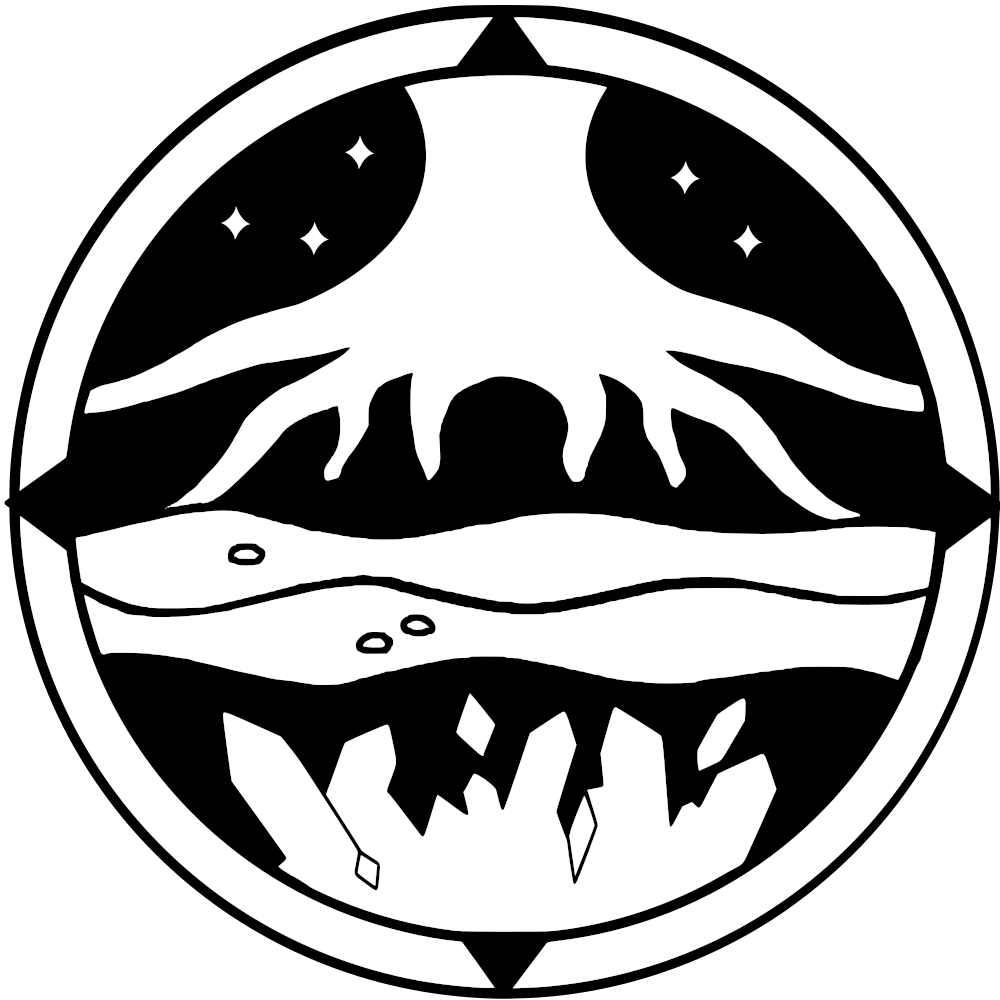

# **ASKGEO's Geology Hub**

Welcome! I am a hydrogeologist interested in how catchment hydrology affects ecosystem health.
I’m also an active educator in geoscience through outreach and teaching.

Please find my past projects under **Research** and geoscience resources under **GeoTutor**.

 
<i>

> *Long live the weeds and the wilderness yet. -Gerard Manley Hopkins*

</i>

 

ASKGeology is Abigail Knapp's hub for geology research and geoscience outreach.

 

### More links

<a href = "https://twitter.com/GeoAbby">

Twitter

</a>

<a href = "https://www.linkedin.com/in/askgeology/">

LinkedIn

</a>
  
<a href = "https://github.com/askgeo">
  
Github
  
</a>

